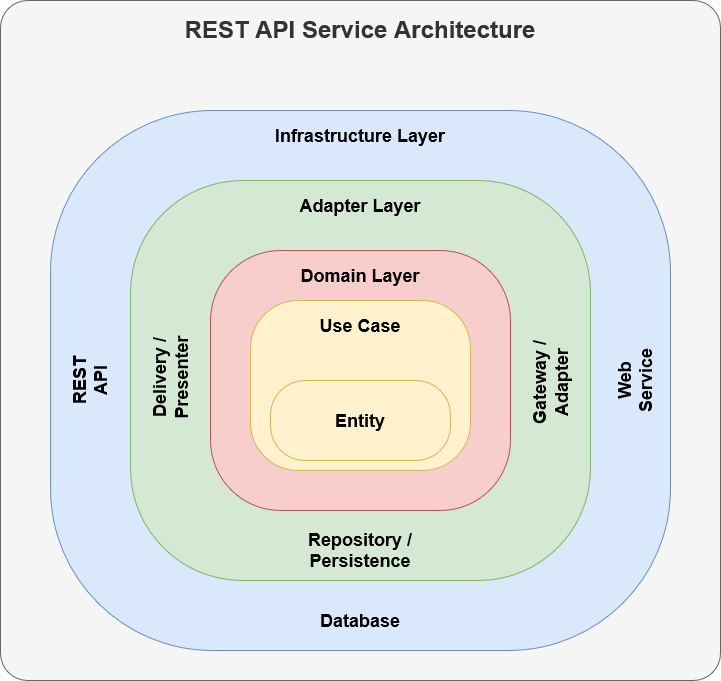

# Spring Boot project template

## Run
gradlew bootRun

## Build Jar
gradlew clean build

## Run Jar
java -jar [jar file]

## Build Image 
gradlew bootBuildImage

## Build Image by Dockerfile
docker build -t "member-service:1.0.1" .

docker build -t kasamsun/hbl-member-service:1.0.1 --build-arg=build/libs/member-service-1.0.1.jar .

## Run Image
docker run -it -p8091:8091 member-service:1.0.1

docker run -it -p8091:8091 kasamsun/hbl-member-service:1.0.1

## Push Image
docker login
docker push kasamsun/hbl-member-service:1.0.1

## Run on Minikube
kubectl run member-service --image=kasamsun/hbl-member-service:1.0.1 --port=8091
kubectl expose pod member-service --target-port=8091 --type=NodePort
minikube service kube-demo --url

